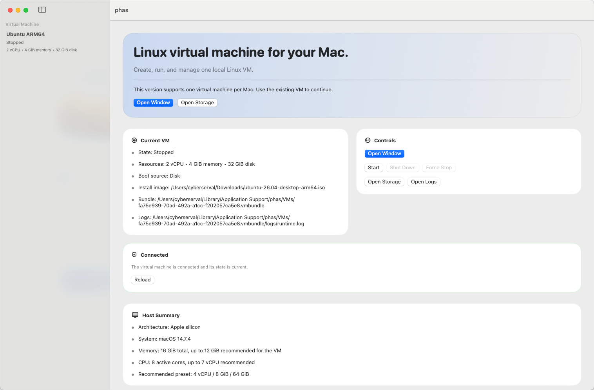

# phas

phas 是一个基于 Apple 原生 Virtualization.framework 的本地 Linux 虚拟机应用，面向 Apple silicon 的 macOS 14+。当前仓库聚焦于单 VM MVP：把创建、安装、启动、停止、恢复和本地验证链路做完整，而不是扩展成多虚拟机平台。

## GUI 预览



当前首页把单 VM MVP 的核心操作集中在一个主界面里：已有虚拟机概览、运行控制、恢复提示，以及宿主机资源建议都会直接显示在这里。

## 项目状态

- 已具备单 VM 创建向导、运行窗口、持久化存储和基础生命周期控制
- 已具备应用 relaunch 后的恢复、显式错误化和最小诊断面板
- GUI 已提供简体中文、English、日语三语本地化
- 仓库内置可复跑的构建、单测和 verification matrix

## 核心能力

- 创建一台 Linux ARM64 虚拟机，并保存到本地 VM bundle
- 使用 ISO 安装镜像完成首次安装，后续从磁盘重复启动
- 提供独立运行窗口、详情视图和 Start / Shut Down / Force Stop 控制
- 提供 admission 校验、恢复建议和基础错误提示
- 使用 NAT 网络作为默认联网方式

## 当前范围

- 只做单 VM MVP，不扩展到多 VM 管理
- 只支持 Apple silicon 和 macOS 14+
- 主验收镜像为 Ubuntu Desktop ARM64 LTS
- Fedora Workstation ARM64 作为补充兼容性验证
- 不包含桥接网络、共享目录、剪贴板、音频、Rosetta、快照或自动发布流程

## 环境要求

- Apple silicon Mac
- macOS 14+
- Xcode 15.4
- XcodeGen 2.44.1+

## 快速开始

### 1. 生成工程

```bash
xcodegen generate
```

仓库已经内置 Xcode 15.4 兼容性修正，重新生成工程时会自动把 `project.pbxproj` 的 object version 规范化到可用版本。

### 2. 构建应用

```bash
xcodebuild -project phas.xcodeproj -scheme phas -configuration Debug build CODE_SIGNING_ALLOWED=NO
```

### 3. 运行测试

```bash
xcodebuild -project phas.xcodeproj -scheme phas -destination 'platform=macOS' test CODE_SIGNING_ALLOWED=NO
```

### 4. 跑验证矩阵

```bash
ruby scripts/verify_matrix
```

需要更窄的回归验证时，可以只跑指定 lane：

```bash
ruby scripts/verify_matrix smoke
ruby scripts/verify_matrix runtime recovery
```

## 仓库结构

- `App/`: 应用入口与通用 UI 支撑
- `Features/`: 首页、创建向导、运行窗口等产品界面
- `Domain/`: VM 生命周期、状态、恢复等领域模型
- `Infrastructure/`: 持久化、Virtualization 装配、校验、日志与系统依赖
- `Resources/`: 本地化资源与应用资源
- `Tests/`: 单元测试与回归测试
- `docs/`: 操作、构建、运行时与验证文档

## 文档入口

- 构建与运行：[docs/build-run.md](docs/build-run.md)
- 操作指引：[docs/operator-guide.md](docs/operator-guide.md)
- 创建向导：[docs/create-wizard.md](docs/create-wizard.md)
- 运行窗口与生命周期控制：[docs/runtime-ui.md](docs/runtime-ui.md)
- 恢复与诊断：[docs/recovery-diagnostics.md](docs/recovery-diagnostics.md)
- 验证矩阵：[docs/verification-matrix.md](docs/verification-matrix.md)
- 验收台账：[docs/acceptance-ledger.md](docs/acceptance-ledger.md)

## 产品与规划文档

- 产品需求定义：[PRD.md](PRD.md)
- Phase workflow：[plan/workflow.md](plan/workflow.md)
- 当前执行状态：[plan/handoff.md](plan/handoff.md)
